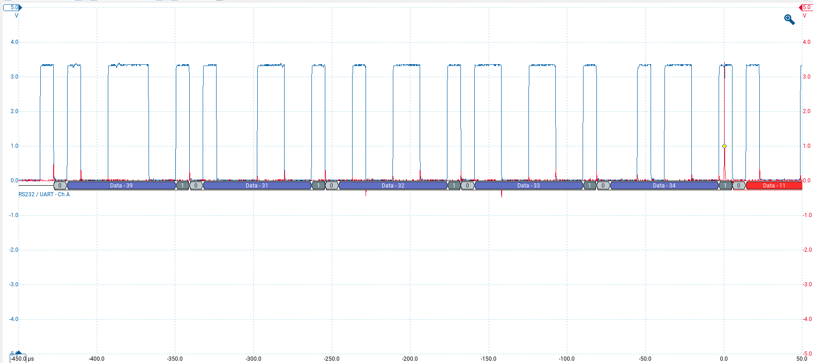

# UART

Use RP2040's PIO to capture and push data to its secondary core, which will generate a trigger once the data matches the reference pattern. Tweak the cycle counts in the PIO program to get closer or further inside the stop bit. Tweak the PIO program if not using 8N1.

There is ~1us jitter between the rising edge of the last bit to the stop bit and the trigger signal.

